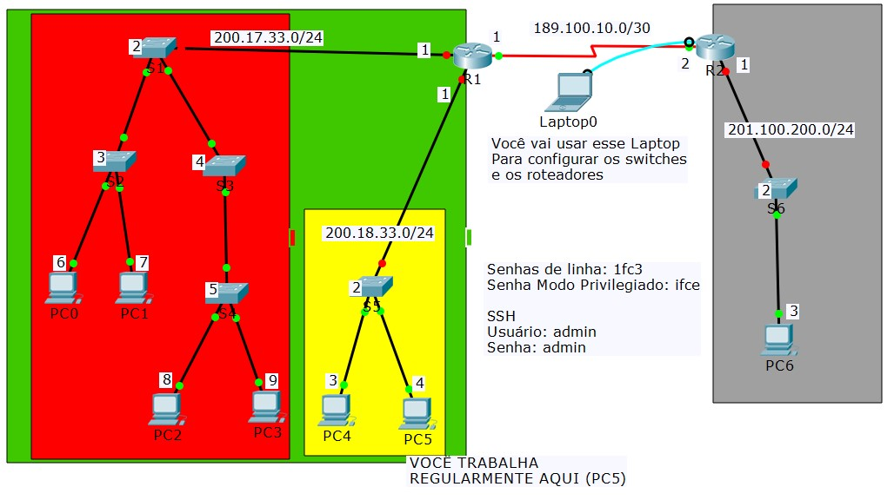
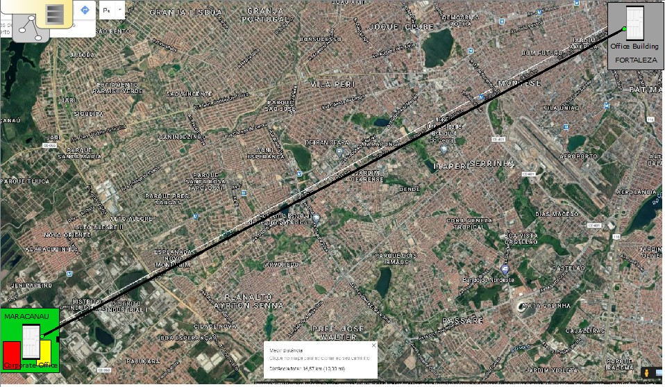

# Configuração de dispositivos

Suponha que você trabalha no IFCE Maracanaú (Caixa verde) e precisa configurar os dispositivos (_switches_, roteadores e computadores) do _campus_ Maracanaú, bem como alguns equipamentos no _campus_ Fortaleza.

Lembre-se que para configurar um _Switch_ ou Roteador, você precisará de um cabo de console.

# Descrição da Rede

A rede como um todo está dividida em partes.

## Campus Fortaleza
Os equipamentos que estão localizados no _campus_ Fortaleza encontram-se dentro da caixa cinza.

## Campus Maracanaú
Os equipamentos do _campus_ Maracanaú encontram-se dentro da caixa verde. Como você é o principal responsável dentro desta unidade, você também dividiu (para facilitar o gerenciamento) a rede do Maracanaú em duas redes menores

### Rede Vermelha
Onde se encontram os laboratórios.

### Rede Amarela
Onde se encontra a equipe de TI.

## Definições Gerais
- Ao lado de cada equipamento, você encontrará um número que indica o **final do endereço IP** a ser usado naquele equipamento.
- No cabo que liga o _switch_ principal ao roteador, você encontrará o **endereço de rede**. Para este exercício, vamos considerar o endereço de rede como sendo semelhante ao endereço IP, mas com final sempre igual a **0** (zero).
- O endereço IP de cada dispositivo deve ser igual ao endereço de rede, trocando o último valor pelo que está ao lado do dispositivo. Por exemplo
  - O PC 0 tem uma caixa com o número 6.
  - Este PC também está ligado ao _Switch_ **S2** que está ligado ao _Switch_ **S1** que está ligado ao Roteador **R1**.
    - Todos os equipamentos ligados por meio de _Switches_ fazem parte da mesma rede.
  - Assim, o PC0 deverá ter seu IP configurado como
    - `200.17.33.6`
  - A máscara de rede de todos os equipamentos deve ser
    - `255.255.255.0`

### Definições Para Switches e Roteadores
- Todo _Switch_ e todo Roteador deve ter um nome (_hostname_). Os nomes dos equipamentos estão ao lado deles.
  - R1
  - R2
  - S1
  - S2
  - ...
- As senhas para os _switches_ e roteadores são:
  - Senhas de linhas (console e vty)
    - `1fc3`
  - Senha de modo privilegiado (administrador)
    - `ifce`
  - Senha para SSH
    - usuário `admin`
    - senha `admin`

- Observações Gerais
  - Lembre-se que você trabalha no _campus_ Maracana.
    - Sua estação de trabalho (computador onde você fica) é o PC5 que fica na sala de TI
  - Algumas vezes, você precisará alterar a configuração dos _switches_ que ficam no bloco de ensino.
  - Outras vezes, você precisará alterar a configuração do switch que fica no _campus_ Fortaleza.

  - **Para você pensar um pouco**
    - Você acha mais fácil ir até o _campus_ Fortaleza (ou mesmo até o bloco de ensino) quando precisar mudar a configuração do _switch_ daquele bloco? Ou seria mais fácil se você pudesse usar um terminal (_prompt_) de comandos no seu computador para acessar os _switches_ onde quer que eles estejam?
    - Como você poderia acessar esses _switches_ sem usar um cabo de console?
    - Como você poderia acessar esses _switches_ sem sair da sua máquina?
      - O que você precisa para realizar este acesso?

# Observação
- Mesmo que você não tenha como realizar esta atividade em computador, descreva em uma folha de papel ou em um arquivo do Google Docs todos os passos necessários para realizar as configurações, bem como as respostas dos questionamentos da seção **Para você pensar um pouco** acima.